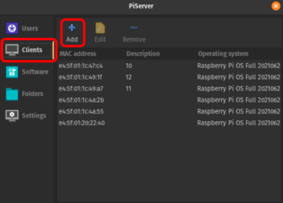
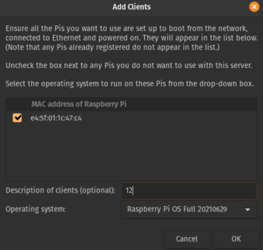
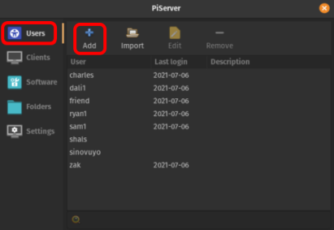
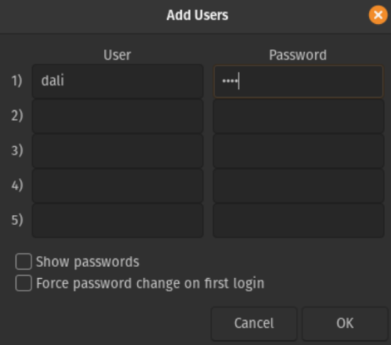

# Bulungula Tech Centre
This repository contains the instructions to replicate the low-cost, low-power computer lab we built at the Bulungula College, a school in rural South Africa. Our goal was to use free and open-source software to make this solution as accessible as possible. Please see our [`GitHub Pages Site`](https://bulungula-tech-centre.github.io/) for more about the project's motivation and context.

## Overview

### Power and Internet Constraints
Our solution is targeted at rural schools which may have significant electricity and internet constrains. In our case, the school was completly off grid and relied on a solar-panel installation for electricity. The school also had limited access to the internet. The only way to get online was to use an LTE router which, in such a remote area, can be unreliable and expensive. 

To operate within the power constraint, our solution proposes using Raspberry Pis instead of fully fledged PCs. Raspberry Pis are relativly inexpensive and consume very little power. This makes them the perfect solution for the off-grid setting. To adress the internet constraint, we propose an offline content sharing server such that learning materials can be downloaded from the internet once and then shared indefinitely on the local network.

### Client-Server Architecture
To facilitate easy administration and maintainance of the computer lab we used a client-server architecture whereby there is one central server-PC which controls all of the client PCs. This setup is useful because it allows one to control all of the cleint PCs from the central PC. This makes it easy to push software and security updates to all of the client PCs. Moreover, the server stores the shared content on the local network for the clients.

Another benefit of the client-server architecture is that we can network-boot the Raspberry Pis from the server. So, instead of attaching storage and an OS to each indevidual Raspberry Pi we can serve the operating system to all the Pis over the local network. The file system is stored and shared on the central server which means that users can login into their account on any of the client PCs and have access to their files. This kind of networked solution can cost thousands of dollars if you use enterprise software but thankfully there is an incredible free and open-source solution developed by the Raspberry Pi Foundation called [`Piserver`](https://github.com/raspberrypi/piserver) which we used for this project. 

### Offline Digital Learning Platform
To give the students using the computer lab the best digital learning experience possible we propose using [`Kolibri`](https://learningequality.org/kolibri/), an incredible free and open-source Offline Digital Learning Platform developed by the Learning Equality Foundation. `Kolibri` makes it possible for teachers to create digital lessons for their students in the computer centre.

### Remote Troubleshooting and Support
Another very important consideration when developing a solution for a remote location such as a school in rural South Africa is how to fix the system in the event that something goes wrong. While it is important that people on-site receive sufficient training to be able to address most issues on-site, it is important to have a remote support plan in place to recover the system from unforseen issues. To facilitate this we propose a solution which uses a free and open-source VPN solution to securly connect to the computers local network from anywhere in the world. This makes it possible for an expert to offer remote support via SSH or remote desktop if neccesary. 

---

## Setup Guide

> #### What you will need:
> - *n* x Raspberry Pi 4s (*n* will depend on your use case, we had 15)
> - One micro SD card for initial setup of the Pis
>   - Minimum 8GB
> - A server computer (this can be a laptop, another Pi, a desktop computer or an actual server)
>   - For any of these options, a decent storage capacity will be required (Minimum 64GB) to boot from and serve content to the client Pis
>   - Depending on your use-case you may need a lot more storage (our server has a 480GB SSD which holds all the offline educational content)
> - *n+2* ethernet cables
> - A switch (with at least *n+2* ports)
>   - This can be a gigabit switch (recommended) or a router configured to act as a switch
> - 4G/LTE Router (use as DHCP server)
> - *n* x accessories for each of the Pis
>   - Monitors, keyboards, mouses, microHDMI-to-HDMI cables, power supplies, headphones etc.

### Setting up the Client Pis
- You will need to first boot the Pis from an SD card. In order to do this, we recommend you use [`Raspberry Pi Imager`](https://www.raspberrypi.org/software/) to write your chosen OS ([`Raspberry Pi OS`](https://www.raspberrypi.org/software/operating-systems/#raspberry-pi-os-32-bit) is probably simplest) to the SD card

- Then repeat the following for each of the Raspberry Pi 4s that are going to be used as client devices:
  - Insert the SD card into the Pi and connect the power supply
  - Connect the Pi to a display with a microHDMI-to-HDMI cable. You should see the Pi booting
  - Once booted, go to the terminal (CTRL+ALT+T from the RPi-OS desktop) and type the following line: 
  
    `echo program_usb_boot_mode=1 | sudo tee -a /boot/config.txt`
  
    This adds "*program_usb_boot_mode=1*" to the end of the *config.txt* file. Now the Pi should be able to boot from a network.

  - Reboot the Raspberry Pi with `sudo reboot`
  - Once it has rebooted, check that the OTP has been programmed by running the following command in the terminal:

    `vcgencmd otp_dump | grep 17:`

    If the output is  `0x3020000a`, then you have been successful.

   - The Pi configuration is almost done. The final thing to do is to remove the `program_usb_boot_mode` line from *config.txt* (also make sure there is no blank line at the end). You can do this with any text editor (`sudo nano /boot/config.txt`, for example). 
    - Finally, shut the Raspberry Pi down (`sudo poweroff`). 

### Physical Device Setup
The Pis, Server and Router have to be connected to create a local network. This is where the Switch comes in handy. All devices should be connected using ethernet cables, as shown in the Wiring Diagram below. Do not insert the power supplies into the Pis yet. (\*why not?)

### Configuring the 4G Router
**\*TODO**

### Setting up the Server
We have used a relively beefy desktop computer running [`Pop!\_OS`](https://pop.system76.com/) (other Linux distributions should/could work). **maybe mention how we had a bit of trouble with the other dirtributions we tried?**

Once you have your server PC up and running, the first step is to install `piserver`. Follow the instructions on [`piserver's GitHub page`](https://github.com/raspberrypi/piserver). You might need to run `sudo apt update` and `sudo apt upgrade` first.

\* **TODO:** More info on getting client OS's onto piserver?

### Booting Up!
Now that the Raspberry Pis and Server are set up, and all the devices are connected, the Pis can be booted over the network. 
1. In the server's terminal, run `sudo piserver` to open *piserver*
2. Turn on the Pis (plug in their power supplies). They will first try to load an operating system from storage; but because there are no SD cards, they will revert to attempting to fetch an OS from the local network (they continue trying as long as they are left on). You should see the following 'waiting screen': 
 
\* **TODO:** insert screenshot of waiting screen

3. In the `piserver` GUI, click on the `Clients` tab on the left, then click `Add` at the top. 

4. You will be taken to the “Add Clients" screen. If the Pi/Pis have been connected to the network and turned on correctly, then the MAC address should appear here (might take ~30seconds for them to first start up). Add a description (the number or name you would like to assign to the Pi). Choose the OS you wish to serve to the client Pi/s. And then select “OK”

5. The Pi/s should boot up and show you the login screen. Now we need to add users to login with. Back in the piserver GUI, navigate to the "Users" tab and click "Add".

6. Fill out up to five users' details (you can add more later). Click "OK". Now a user should be able to login to any of the Pis and create their own environment with personal settings, folders, wallpapers, etc. and access it all no matter which Pi you use next time. Easy as that!

### The Daily User Guide
For more info on creating shared folders, editing users, deleting users, please see our [`Technical Guide`](https://docs.google.com/document/d/1NRzISrL2ashDNrijnIuj6bVMliiEPxsDaAkP4UzLzbY/edit?usp=sharing). :)

### General Trouble Shooting
|                                  Bug                                  |                                                                                                                                                                                                                                                                                                                                                                                                         Solution                                                                                                                                                                                                                                                                                                                                                                                                        |
|:---------------------------------------------------------------------:|:-----------------------------------------------------------------------------------------------------------------------------------------------------------------------------------------------------------------------------------------------------------------------------------------------------------------------------------------------------------------------------------------------------------------------------------------------------------------------------------------------------------------------------------------------------------------------------------------------------------------------------------------------------------------------------------------------------------------------------------------------------------------------------------------------------------------------:|
| Pi not network booting                                                | - Determine whether there is a device acting as the DHCP server. If there is no DHCP server (an example of this is if you do not have a router connected to the Pis -- the router generally acts as the DHCP server), you will need to configure piserver to act as the DHCP server. Piserver has to be configured to assign IP addresses to the clients when they boot. Go to settings on the piserver application, and select "Act as a standalone DHCP server".  - Plug in the ethernet cable to Pi before supplying power for boot.  - Check whether new IP addresses have been allocated to the server and/or Pis. New IPs might have been assigned when the server restarted if the server wasn’t connected to the router.  - Take out keyboard and/or mouse (seemed to only be a mac keyboard though) when booting. |
| All the Pis are frozen (only mouse moves)                             | The local network is disconnected.  - Perhaps the server is off? When the server is turned back on, the Pis should continue where you left off  - Connection to server is broken. Check the light at the switch for whether it is on for the server. If it is not, check whether the server’s ethernet cable is connected correctly to the server and/or switch. If that doesn’t work, the ethernet cable might need to be replaced. When the connection to the server is restored, the Pis should continue where you left off.                                                                                                                                                                                                                                                                                           |
| Only one Pi is frozen (only mouse moves)                              | The Pi could be disconnected from the local network.   - Check the LED at the switch to see if it is communicating with the Pi. If it is not, check if the ethernet cable for that Pi is connected correctly to the Pi and/or the switch correctly. If they are connected correctly and it still doesn’t resolve the problem, the ethernet cable might need to be replaced.                                                                                                                                                                                                                                                                                                                                                                                                                                              |
| Shared folder vanishes or file does not open on a client Raspberry Pi | - Restart the Pi: Unplug the LAN cable and then the Pi power cable. Plug them in again and login to the same account, everything should be accessible and back to normal                                                                                                                                                                                                                                                                                                                                                                                                                                                                                                                                                                                                                                                |
| Application opening too slowly                                        | - Simply “reboot” the Pi.                                                                                                                                                                                                                                                                                                                                                                                                                                                                                                                                                                                                                                                                                                                                                                                               |
| Pi will not boot (but is has booted previously)                       | - Check if the router is disconnected (look at the router’s LED on the switch). Connect the router. Plug the power supplies into the Pis again.   - The Pi was “shutdown”. You will need to either remove the power supply and put it back in, or turn the power off and on at the wall.                                                                                                                                                                                                                                                                                                                                                                                                                                                                                                                                 |
| Pi is working fine, but internet is not working                       | - The router might be disconnected from the network: Check the router’s light on the switch. If it is off, check the ethernet cable’s connection at the router and/or switch.  - Router out of data: Load data onto the sim.                                                                                                                                                                                                                                                                                                                                                                                                                                                                                                                                                                                             |
| Pi3B won't network boot                                               | - Pi 3Bs don’t network boot as easily as 3B+s. This is because their boot firmware is out of date. One can work around this by loading the up-to-date boot file onto a blank SD card and inserting it into the Pi 3B. Note the SD card should have nothing on it except the boot file. See this github issue to download the boot file and get more info on the [GitHub issue](https://github.com/raspberrypi/piserver/issues/40).                                                                                                                                                                                                                                                                                                                                                                                      |
